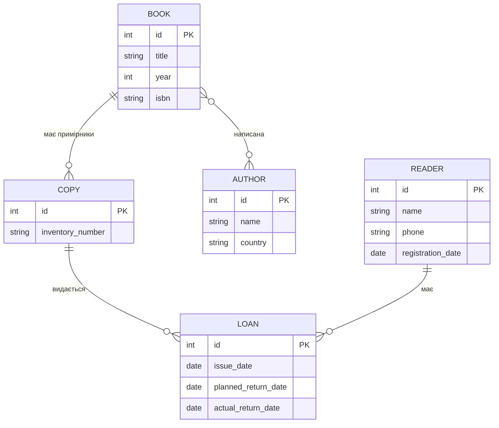

```mermaid
erDiagram
    BOOK {
        int id PK
        string title
        int year
        string isbn
    }
    COPY {
        int id PK
        string inventory_number
    }
    AUTHOR {
        int id PK
        string name
        string country
    }
    READER {
        int id PK
        string name
        string phone
        date registration_date
    }
    LOAN {
        int id PK
        date issue_date
        date planned_return_date
        date actual_return_date
    }

    BOOK }o--o{ AUTHOR : "написана"
    BOOK ||--o{ COPY : "має примірники"
    COPY ||--o{ LOAN : "видається"
    READER ||--o{ LOAN : "має"
```